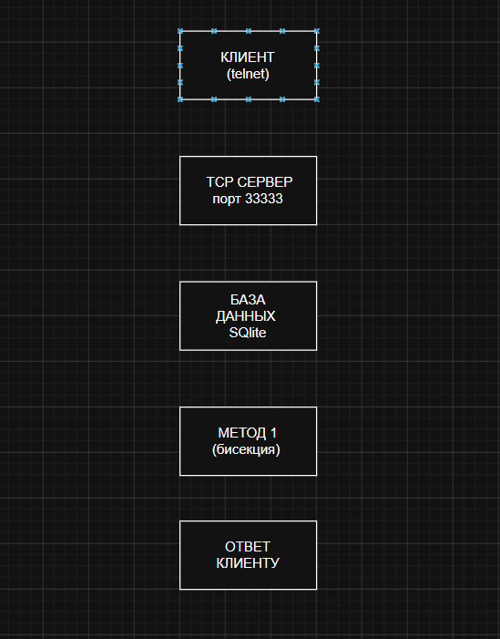

# EchoServer

TCP сервер на C++/Qt для решения математических задач методом половинного деления.

**Автор:** Негматов Хадиятилло

## Возможности
- Многопользовательский режим
- Регистрация и аутентификация
- Сохранение истории в SQLite
- Статистика использования

## Быстрый старт
```bash
git clone https://github.com/hnegmatov41-alt/echo-server.git
cd echo-server
qmake echoServer.pro
make
./echoServer

Пример задачи:
1 1 2 112x^3 - x - 2


Описание
/reg user pass group	Регистрация
/login user pass	Вход
/history	История
/stats	Статистика

Схема работы
Клиент → Сервер → БД
           ↓
      Метод решения

Документация
https://github.com/hnegmatov41-alt/echo-server/wiki

Лицензия
MIT

5. Пролистай вниз, нажми **Commit changes**

---

### Шаг 2: Проверить ветку develop на GitHub

1. На главной странице репозитория нажми на кнопку **main**

2. В выпадающем списке выбери **develop**

3. Если там есть README — значит ветка есть

---

### Шаг 3: Создать Wiki страницы

1. Нажми на вкладку **Wiki**

2. Нажми **"Create the first page"**

3. Название: `Home`, вставь текст ниже:

```markdown
# EchoServer - TCP сервер

## Команды
| Команда | Описание |
|---------|----------|
| `/reg user pass group` | Регистрация |
| `/login user pass` | Вход |
| `/history` | История |
| `/stats` | Статистика |

## Формат задачи
1 1 2 112x^3 - x - 2

